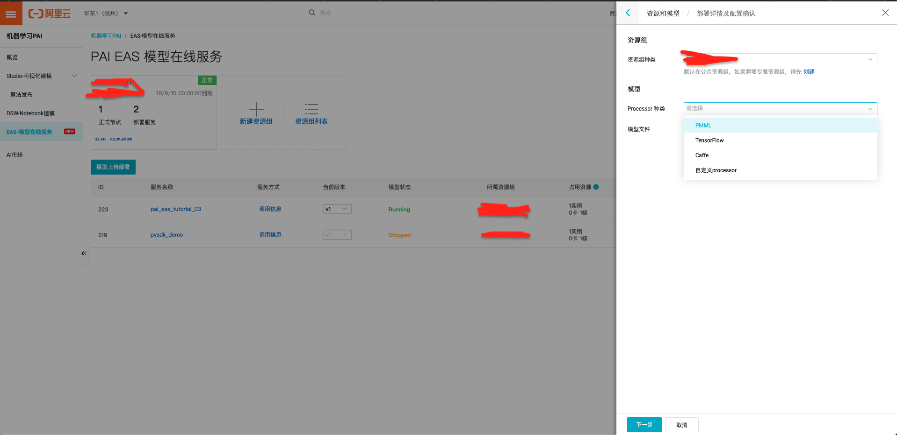
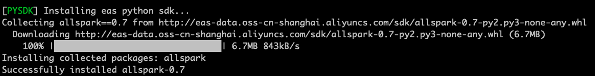
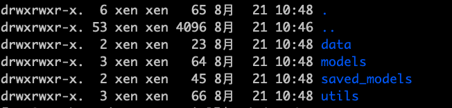
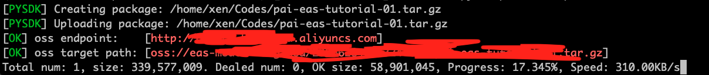
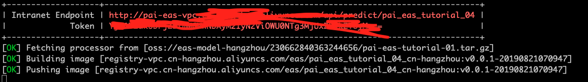

# PAI-EAS-Tutorial
目前，PAI EAS提供的在线预测服务部署方式有四种：

- 控制台上传模型（网页操作）
- PAI Studio一键部署（需使用阿里云全家桶）
- PAI DSW部署（同上）
- 本地客户端部署（线下终端部署）

于是，在没有使用`阿里云全家桶`的情况下，我们只能通过"控制台上传模型"、"本地客户端部署"两种方式进行部署。下面介绍以上两种方式部署的优缺点：

##### 控制台上传模型部署

- 优点：Easy to use，点几下就完事；



- 缺点：支持的Processor种类有限制（Processor是包含在线预测逻辑的程序包，阿里云已经针对常用的PMML、TensorFlow、Caffe提供好了内置的Processor，这几类的常规模型都可以直接使用我们的内置Processor进行服务部署，节省开发在线预测逻辑的成本。）,但是自由度不够高，往往对模型格式等都有严格要求，并且对使用Python进行数据预处理、后处理不友好。

##### 本地客户端部署

- 优点：使用本地客户端通过自定义Processor PythonSDK的方式部署在线预测服务，可以实现用Python"想怎么写就怎么写"的极高自由度模型构建、逻辑处理等操作；
- 缺点：需在终端使用`eascmd`进行服务管理（创建服务，删除服务，查看服务状态，修改服务等）、部署，所以需要记一些命令。（在GPU服务器已对客户端工具`eascmd`下载配置完成，大家可以通过`eascmd64 --help`查看详细信息）

##### 使用`eascmd`部署在线预测服务简单示例

通过上述介绍，相信大家对PAI EAS模型在线服务部署都有了一定的了解（控制台部署：简单不自由、终端部署：自由不简单）。坚持使用控制台部署的小伙伴看到这就差不多啦，祝您生活愉快:)。接下来将通过一个简单的示例（使用esim模型对两句话进行相似度预测），教会大家如何在终端使用`eascmd`部署自己的在线预测服务。

##### Step 0: 配置`eascmd`

使用`eascmd`部署在线预测服务时，需要提供自己的阿里云AccessKeyId和AccessKeySecret：

```shell
eascmd64 config -i <AccessKeyId> -k <AccessKeySecret> -e pai-eas.cn-hangzhou.aliyuncs.com
```

通过`-e`指定region。

##### Step 1: 使用`eascmd`初始化项目

命令：`eascmd64 pysdk init pai-eas-tutorial/`

输入python版本，建议3.6；


该命令实现的功能大致为（不想知道的同学，可跳过）：新建名为`pai-eas-tutorial`的文件夹，在该文件夹下使用`conda`新建名为`ENV`的虚拟环境（服务所需所有依赖均装在该虚拟环境下），自动安装部署所需相关依赖，like this：



初始化完成后，在`pai-eas-tutorial`目录下可以看到：

- `app.json`用于描述服务部署过程中相关配置信息；
- `ENV`虚拟环境文件夹
- `app.py`该文件在服务正式部署前需要自己改写其中相关代码，用于指导预测服务的正常运行（主要包括模型加载、数据预处理、后处理逻辑）

##### Step 2: 将模型预测所需文件移至初始化后目录，并改写`app.py`（编写预测逻辑）

在部署服务之前，相信你应该训练完成了自己的预测模型，于是你的项目目录应该是这样的：



- `data`目录下存放预测服务过程中所需的数据文件，（vocab.txt）
- `models`目录下存放有模型结构代码，一般用于模型恢复（esim.py）
- `saved_mdoels`目录下存放有模型持久化文件（esim.h5）
- `utils`目录下存放有预测服务过程中，数据处理等一系列琐碎的代码（data_utils.py）

将你要部署的项目相关文件移至刚刚初始化的名为`pai-eas-tutorial`目录下，于是当前完整的项目结构是：

```shell
.
├── ENV
├── app.json
├── app.py
├── data
├── models
├── saved_models
└── utils
```

将你的项目移到待部署的项目下，并使用新的虚拟环境运行，想必有很多依赖需要安装。以本任务为例，需要安装`tensorflow`、`keras`、`numpy`、`pandas`（注：由于当前线上机器只有CPU，所以此处的`tensorflow`为CPU版本，GPU版本请安装`tensorflow-gpu`）。值得注意的是，安装过程需要指定`ENV`虚拟环境的`pip`，即：

```shell
./ENV/bin/pip install tensorflow keras numpy pandas
```

接下来将改写`app.py`中的代码，首先通过`eascmd`初始化后的`app.py`原始代码如下：

```python
# -*- coding: utf-8 -*-
import allspark

class MyProcessor(allspark.BaseProcessor):
    """ MyProcessor is a example
        you can send mesage like this to predict
        curl -v http://127.0.0.1:8080/api/predict/service_name -d '2 105'
    """

    def initialize(self):
        """ load module, executed once at the start of the service
         do service intialization and load models in this function.
        """
        self.module = {'w0': 100, 'w1': 2}

    def pre_proccess(self, data):
        """ data format pre process
        """
        x, y = data.split(b' ')
        return int(x), int(y)

    def post_process(self, data):
        """ proccess after process
        """
        return str(data).encode()

    def process(self, data):
        """ process the request data
        """
        x, y = self.pre_proccess(data)

        w0 = self.module['w0']
        w1 = self.module['w1']

        y1 = w1 * x + w0

        if y1 >= y:
            #return str("True"), 0
            return self.post_process("True"), 0
        else:
            return self.post_process("False"), 0

if __name__ == '__main__':
    # paramter worker_threads indicates concurrency of processing
    runner = MyProcessor(worker_threads=10)
    runner.run()
```

该段代码中实现了名为`MyProcessor`的类，该类继承自基类`BaseProcessor`，需要你覆写其中的`initialize()`、`process()`方法。在服务开启时，会调用一次`initialize()`方法，所以你需要将加载模型及一些全局变量的定义声明写在其中，防止服务调用过程中，重复加载模型浪费资源、降低性能。在`process()`方法中可以实现自己的模型预测逻辑，从上面源码可以看见，该类中还实现有`pre_process()`及`post_process()`方法用于模型预测过程中对数据的预处理、后处理。这些方法可依据你的具体情况进行实现，可要可不要，也可以多要，自由发挥即可。目的是帮助覆写的`process()`方法完整地实现自己想要的模型预测功能。值得注意的是，`process()`方法返回的参数有两个，分别为`response_data`和`status_code`，即"返回值"与"状态码"。正常请求中，"状态码"可返回0或200。

下面贴出，本教程任务（基于ESIM的文本相似度模型预测）的`app.py`帮助大家理解：

```python
# -*- coding: utf-8 -*-
import allspark
from models.model_config import ESIMConfig
from models.model import ESIM
from utils.load_data import char_index
import tensorflow as tf


class MyProcessor(allspark.BaseProcessor):
    """ MyProcessor is a example
        you can send mesage like this to predict
        curl -v http://127.0.0.1:8080/api/predict/service_name -d '2 105'
    """

    def initialize(self):
        """ load module, executed once at the start of the service
         do service intialization and load models in this function.
        """
        self.model_config = ESIMConfig()
        self.model = ESIM(self.model_config).get_model()
        self.model.load_weights('saved_models/esim_LCQMC_32_LSTM_0715_1036.h5')
        self.model._make_predict_function()
        global graph
        graph = tf.get_default_graph()

    def pre_proccess(self, data):
        """ data format pre process
        """
        x, y = data.split(b' ')
        x, y = char_index([str(x, encoding="utf-8")], [str(y, encoding="utf-8")])
        return x, y

    def process(self, data):
        """ process the request data
        """
        x, y = self.pre_proccess(data)
        global graph
        with graph.as_default():
            y_pred = self.model.predict([x, y]).item()
        return float(y_pred), 0


if __name__ == '__main__':
    # parameter worker_threads indicates concurrency of processing
    runner = MyProcessor(worker_threads=10)
    runner.run()

```

##### Step 3: 本地测试服务

暂有BUG，可跳过。

开启服务：

```shell
./ENV/bin/python app.py
```

重新开一个终端：

```shell
curl http://127.0.0.1:8080/test  -d '今天天气不错 今天天气不好'
```

##### Step 4: 线上服务发布

线上服务发布，可分为两个步骤：打包上传、部署服务。

打包上传：

```
cd ..
eascmd64 pysdk pack -u ./pai-eas-tutorial/
```



待上传完毕，记下`oss target path`，用于修改`app.json`用于服务部署。

部署服务，其实就是修改`app.json`+创建服务，原始`app.json`文件内容如下：

```shell
{
  "name": "pysdk_demo",
  "processor_entry": "./app.py",
  "processor_type": "python",
  "processor_path": "oss://path/to/processor",
  "metadata": {
    "region": "cn-beijing",
    "instance": 1,
     "memory": 2000,
     "resource": "",
     "cpu": 1
    }
}
```

修改如下：

```shell
{
  "name": "pai_eas_tutorial_04",
  "processor_entry": "./app.py",
  "processor_type": "python",
  "processor_path": "oss://path/to/processor",
  "metadata": {
    "region": "cn-hangzhou",
    "instance": 1,
    "memory": 2000,
    "rpc.keepalive": 10000,
    "resource": "resource_id",
    "cpu": 1
  }
}
```

具体字段意义及其他功能字段添加请参考[官方文档](https://help.aliyun.com/document_detail/111031.html?spm=a2c4g.11186623.6.610.75185ad1xEK253)。

创建服务：

```shell
eascmd64 create app.json
```



图中的Intranet Endpoint，Token需要记录下来，用于服务调用。

##### Step 5: 服务调用

本教程首先给出使用`curl`进行服务调用的简单示例，未来将给出多语言服务调用模版：

```shell
curl http://pai-eas-vpc.cn-hangzhou.aliyuncs.com/api/predict/pai_eas_tutorial_04 -H 'Authorization: Authorization_id' -d '没有买 没有买'
```


目前仅支持阿里云机器内部调用。